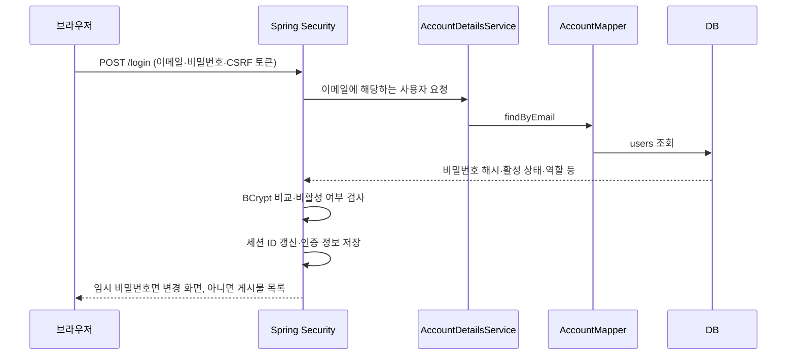

# 백오피스 MVP 코드 읽기 가이드

이 프로젝트는 관리자가 발급한 계정으로 로그인하고, 허용된 게시물을 관리하는 작은 백오피스다. 화면의 표·입력 폼은 기능을 사용하기 위한 기본 구성이다. 최종 IA나 시안을 확정한 것이 아니다. 실행은 [MVP 전달 문서](MVP_DELIVERY.md)를 먼저 참고한다.

## 1. 폴더 구조와 역할

```text
AICA-back-office-main/
├── pom.xml                        # Java·Spring·RTE·MyBatis 의존성과 빌드
├── mvnw / mvnw.cmd / .mvn/         # 같은 Maven 버전으로 실행
├── scripts/
│   ├── mvn-local.ps1               # 현재 PC의 JDK 또는 JAVA_HOME으로 Maven 실행
│   └── run-dev.ps1                 # 개발 서버 실행, 최초 관리자 입력 지원
├── src/main/java/egovframework/backoffice/
│   ├── BackofficeApplication.java # 애플리케이션 시작점
│   ├── stage0/                    # 기존 기동·차단 검증 전용
│   └── mvp/
│       ├── config/                # 업무 코드 등록, MyBatis·RTE 연결
│       ├── security/              # 로그인, 세션 유효성, 공통 권한 정책
│       ├── auth/                  # 로그인 화면·본인 비밀번호 변경
│       ├── account/               # 계정 데이터·발급·역할 변경·초기 관리자
│       ├── post/                  # 게시물 데이터·목록·CRUD
│       └── common/                # 공통 입력 검사·오류 화면·화면 공통값
├── src/main/resources/
│   ├── application.yml            # 공통 설정, 기본 dev 프로필, 세션 설정
│   ├── application-dev.yml        # 개발용 파일 DB
│   ├── application-stage0.yml     # 업무 DB를 사용하지 않는 Stage 0
│   ├── db/migration/h2/           # 개발 DB 테이블 생성 SQL
│   ├── mapper/                    # 실제 계정·게시물 SQL
│   ├── templates/                 # Thymeleaf HTML
│   ├── static/css/                # 기본 화면 스타일
│   └── messages.properties        # RTE 서비스에서 사용하는 안내 메시지
├── src/test/
│   ├── java/.../integration/      # 실제 HTTP·쿠키·DB·재시작 검증
│   ├── java/.../verification/     # Stage 0 기본 검증
│   └── resources/                # 테스트 DB 설정과 Stage 0 전용 SQL
├── src/compatibility/java/        # Stage 0 RTE 검증
├── docs/                         # 설계·검증·사용 설명
├── .local-data/                  # 직접 실행한 개발 DB. Git에 올리지 않음
├── .cache/ / .tools/             # 로컬 캐시·검증용 JDK. Git에 올리지 않음
└── target/                       # 빌드 JAR·테스트 결과. Git에 올리지 않음
```

파일명에 Controller가 붙으면 브라우저 요청을 받고 화면을 선택한다. Service는 권한·입력·업무 규칙을 검사하고 저장 단위를 정한다. Mapper는 Service가 요청한 조회·저장을 SQL로 연결한다. HTML에는 DB를 직접 다루는 코드가 없다.

## 2. 로그인하면 내부에서 일어나는 일



1. `GET /login`은 [AuthController](../src/main/java/egovframework/backoffice/mvp/auth/AuthController.java)가 로그인 HTML을 보여준다.
2. 로그인 버튼이 보내는 `POST /login`은 Controller가 직접 처리하지 않는다. Spring Security의 로그인 필터가 처리한다.
3. [AccountDetailsService](../src/main/java/egovframework/backoffice/mvp/security/AccountDetailsService.java)는 이메일을 정리하고 [AccountMapper](../src/main/java/egovframework/backoffice/mvp/account/AccountMapper.java)를 통해 DB 계정을 읽는다.
4. `DaoAuthenticationProvider`가 입력한 비밀번호와 BCrypt 해시를 비교하고 활성 계정인지 확인한다. DB에는 입력한 비밀번호 원문을 저장하지 않는다.
5. 성공하면 [AccountPrincipal](../src/main/java/egovframework/backoffice/mvp/security/AccountPrincipal.java)에 계정 ID·역할·로그인 당시 버전 등의 정보를 담아 세션에서 사용한다. 인증 후 비밀번호 해시는 principal에서 지운다.
6. 임시 비밀번호를 사용하는 계정은 비밀번호 변경 화면으로 간다. 업무 요청도 서버에서 제한하므로 주소를 직접 입력해 우회할 수 없다.

비밀번호를 잊은 사용자는 SUPER_ADMIN에게 초기화를 요청하는 구조다. 이메일 발송·공개 비밀번호 찾기·일반 회원가입은 없다.

## 3. Spring Security가 하는 일

중심 파일은 [SecurityConfiguration.java](../src/main/java/egovframework/backoffice/mvp/security/SecurityConfiguration.java)다.

| 설정 | 하는 일 |
| --- | --- |
| `PasswordEncoder` | BCrypt로 비밀번호 저장·비교, 비용 값 12 |
| `authorizeHttpRequests` | 로그인·CSS는 공개, 계정 관리는 계정 관리 권한 필요, 게시물은 로그인 필요 |
| `formLogin` | 로그인 입력 처리·실패 안내·성공 후 이동 |
| `logout` | POST 로그아웃, 세션 무효화·쿠키 제거 |
| `sessionFixation` | 로그인 성공 시 세션 ID 변경 |
| 기본 CSRF 보호 | 토큰 없는 변경 요청 차단. Thymeleaf POST 폼에 토큰이 자동 포함됨 |
| `AccountSessionFilter` | 권한 판단 전에 DB의 활성 상태와 로그인 버전을 확인 |

미인증 사용자는 로그인 화면으로 이동한다. 로그인했지만 권한이 없는 계정은 403 응답을 받는다. 로그인 없이 모든 요청을 401로 막던 기존 Stage 0 설정은 `stage0` 프로필에만 남아 있다.

## 4. 역할별 권한을 결정하는 곳

[Role.java](../src/main/java/egovframework/backoffice/mvp/account/Role.java)는 계정에 저장할 역할 이름이다. 실제 허용 행위의 연결은 [AccessPolicy.java](../src/main/java/egovframework/backoffice/mvp/security/AccessPolicy.java)에 모았다.

| 역할 | 계정 관리 | 게시물 범위 |
| --- | --- | --- |
| SUPER_ADMIN | 가능 | 전체 |
| ADMIN | 불가 | 전체 |
| SUPPORTER | 불가 | 본인 |

`MANAGE_ACCOUNTS`, `ALL_POSTS`, `OWN_POSTS`는 코드 안에서 사용하는 작은 행위 구분이다. 별도 권한 테이블이나 권한 편집 화면이 아니다. Controller와 HTML에 역할 비교를 반복하지 않고 정책의 결과를 사용한다.

게시물의 전체/본인 제한은 두 곳에서 함께 적용된다. Service에서 작성자를 확인하고, 목록·개수·수정·삭제 SQL에도 본인 조건을 반영한다. 따라서 목록에서 다른 사람의 글을 숨기기만 한 구조가 아니다. 타인 글의 상세·수정·삭제 주소를 직접 보내도 차단한다.

ADMIN 제거 등 정책이 바뀌면 먼저 `AccessPolicy`의 연결을 바꾸고, `Role`과 DB의 역할 제약·기존 계정값 변환·세션 무효화·테스트를 함께 정리한다. 기존 계정 데이터까지 자동으로 바뀌는 것은 아니다. 마지막 SUPER_ADMIN 보호에 사용한 역할 비교는 계정 생명주기 규칙이므로 `AccountService`에 있다.

## 5. 계정 생성에 연결되는 파일

```text
templates/accounts/form.html
  → POST /admin/accounts
  → SecurityConfiguration: 계정 관리 권한 확인
  → AccountController.create
  → AccountService.create
  → AccountMapper.create
  → mapper/AccountMapper.xml
  → users 테이블
  → 한 번만 보여주는 임시 비밀번호 화면
```

[AccountService](../src/main/java/egovframework/backoffice/mvp/account/AccountService.java)는 DB의 최신 계정 상태를 다시 확인하고 이메일·이름·선택 역할을 검사한다. 일반 생성은 ADMIN 또는 SUPPORTER만 허용한다. 화면 값을 변조해 SUPER_ADMIN을 보내도 거부한다.

임시 비밀번호는 안전한 난수로 생성하고 BCrypt로 저장한다. 발급 결과는 짧게 유지되는 Spring MVC FlashAttribute에 넣어 다음 화면에서 한 번 표시한다. 다시 방문하면 목록으로 이동하고, 응답에는 캐시 방지 헤더가 적용된다. 실제 비밀번호는 DB나 로그에 남기지 않는다.

SUPER_ADMIN 승격은 별도의 `/{id}/role` 화면과 요청으로 처리한다. 자기 역할·활성 상태 변경과 마지막 활성 SUPER_ADMIN 제거는 막는다. 계정 변경 때 `account_guard`의 고정 행 하나를 잠가 서로 동시에 강등하더라도 마지막 관리자가 사라지지 않게 한다.

최초 계정은 [InitialAdminInitializer](../src/main/java/egovframework/backoffice/mvp/account/InitialAdminInitializer.java)가 명시적인 초기화 설정을 읽어 생성한다. 이미 계정이 있으면 건너뛰므로 재기동 때 비밀번호를 덮어쓰지 않는다.

## 6. 게시물 등록: Controller → Service → Mapper → DB


- [PostController](../src/main/java/egovframework/backoffice/mvp/post/PostController.java)는 제목·본문을 받는다. 브라우저가 작성자 ID를 보내더라도 사용하지 않는다.
- [PostService](../src/main/java/egovframework/backoffice/mvp/post/PostService.java)는 세션 사용자에 대응하는 최신 계정을 확인하고, 제목 200자·본문 20,000자 이내의 필수값을 검사한다. 작성자는 로그인한 계정으로 정한다.
- [PostMapper](../src/main/java/egovframework/backoffice/mvp/post/PostMapper.java)는 Stage 0에서 검증한 `EgovAbstractMapper`를 사용해 SQL을 실행한다.
- [PostMapper.xml](../src/main/resources/mapper/PostMapper.xml)의 `#{...}`는 값을 SQL에 안전하게 전달한다. 문자열을 SQL 문장에 직접 이어 붙이지 않는다.
- `@Transactional`이 붙은 Service 호출 안에서 오류가 발생하면 해당 저장 작업이 롤백된다. 성공하면 DB에 반영되고 생성된 ID의 상세 화면으로 이동한다.

수정은 작성자를 바꾸지 않는다. 삭제는 `deleted_at`에 시각을 기록한다. 삭제된 글은 목록·상세·수정 대상에서 제외한다. 복구 화면은 없다. 본문은 HTML 실행 없이 `th:text`로 출력한다.

## 7. 세션이 쓰이는 위치

브라우저는 `JSESSIONID` 쿠키를 보내고, 서버는 그 ID에 해당하는 메모리 세션에서 로그인 정보를 찾는다. JWT나 refresh token 테이블은 사용하지 않는다.

[AccountSessionFilter](../src/main/java/egovframework/backoffice/mvp/security/AccountSessionFilter.java)는 매 인증 요청마다 `users.active`와 `auth_version`을 확인한다. 비밀번호 변경/초기화·역할 변경·비활성화 때 DB 버전이 증가한다. 로그인 당시 버전과 다르면 세션을 무효화하고 다시 로그인하도록 안내한다.

이 검사는 다음 보호 요청부터 적용된다. 이미 실행 중인 요청을 원격에서 취소하는 시스템은 아니다. 계정 관리 Service는 잠금을 얻은 뒤에도 최신 계정을 확인한다. 단일 서버에서는 세션 만료 기본값이 30분이며 재시작하면 로그인 상태는 사라진다. DB의 계정·게시물은 파일에 남는다. 여러 서버를 운영할 경우 세션 공유 방식을 별도로 결정해야 한다.

## 8. IA가 나오면 수정할 곳

| 변경 요구 | 우선 볼 파일·폴더 |
| --- | --- |
| 메뉴 이름·구성·디자인 | `templates/fragments.html`, 기능별 HTML, `static/css/app.css` |
| 콘텐츠 필드 추가 | `post/Post.java`, 입력 Controller/Service, 매퍼 XML, 새로운 DB 마이그레이션 |
| 역할과 게시물 접근 범위 | `AccessPolicy`, 필요 시 `Role`·계정 데이터 전환·관련 테스트 |
| 공개·승인·삭제/보존 정책 | `PostService`, SQL, 화면, 마이그레이션과 검증 |
| 콘텐츠 종류 분리 | 현재 기본 게시판과 실제 요구를 비교한 후 기능 단위를 결정 |

카테고리·기수·태그·첨부파일·영상·에디터·노출 정책은 미리 만들어두지 않았다. 실제 운영 DB에 적용한 마이그레이션을 나중에 덮어쓰지 말고 다음 번호의 변경 SQL을 추가하는 방식으로 관리한다.

## 9. 기존 시스템 소스를 받으면 다시 볼 곳

- 기존 `pom.xml`과 RTE 사용 모듈: 현재 검증 범위를 넘어 MVC/JSP·추적·전용 로깅까지 필요한지.
- 운영 DB·기존 users/posts 구조: 이메일 식별값, ID·이름·날짜 타입, 비밀번호 해시, 기존 데이터 이전.
- 기존 로그인·SSO·세션 구조: 별도 백오피스 로그인인지, 사용자 시스템과 인증을 공유해야 하는지.
- 배포 URL·프록시·HTTPS·여러 서버 여부: 쿠키의 Secure·경로·세션 공유·외부 접근 정책.
- 실제 권한과 콘텐츠 정책: ADMIN 전체 관리, SUPPORTER 본인 조회, 삭제 보존 방식이 업무에 맞는지.

현재 개발용 H2 DDL이나 30분 세션 설정을 기존 시스템의 확정 정책으로 취급하지 않는다. 로그인 실패 제한·계정 재활성화·감사 기록·운영 배포도 후속 확인 항목이다.

## 10. 우선 읽을 핵심 파일 5개

1. [SecurityConfiguration.java](../src/main/java/egovframework/backoffice/mvp/security/SecurityConfiguration.java) — 요청이 로그인·권한 검사와 연결되는 입구.
2. [AccessPolicy.java](../src/main/java/egovframework/backoffice/mvp/security/AccessPolicy.java) — 세 역할과 실제 할 수 있는 일을 연결하는 표.
3. [AccountService.java](../src/main/java/egovframework/backoffice/mvp/account/AccountService.java) — 계정 발급·비밀번호·역할 변경과 보호 규칙.
4. [PostController.java](../src/main/java/egovframework/backoffice/mvp/post/PostController.java) — 브라우저 주소·폼과 Java 메서드의 연결.
5. [PostService.java](../src/main/java/egovframework/backoffice/mvp/post/PostService.java) — 본인/전체 범위, 입력 검사, 저장 트랜잭션.

이후 PostMapper → PostMapper.xml → DB 마이그레이션 순서로 읽으면 데이터가 실제로 저장되는 지점까지 따라갈 수 있다. 동작 예시는 [HTTP 통합 테스트](../src/test/java/egovframework/backoffice/integration/BackofficeIntegrationTest.java)에 모았다.
